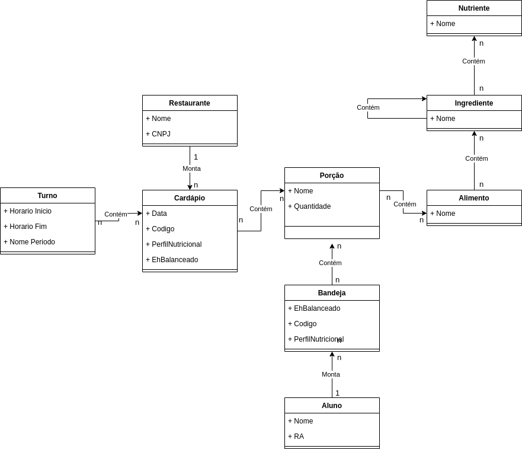

#  - Modelagem Conceitual de Refeições em um Restaurante

# Equipe `Sexteto Sinistro [SEXTO]`

# Subgrupo `PONTE`
* `Gabriel Alves de Arruda` - `248132`
* `Antonio Hideto Borges Kotsubo` - `<RA>`
* `Guilherme Brentan de Oliveira` - `252764`

## Modelo Conceitual ER

# Modelo Conceitual UML

