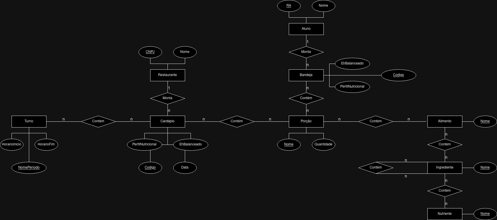

# - Modelo para Apresentação do Lab02 - Modelagem Relacional de Refeições em um Restaurante

Estrutura de pastas:

# Equipe `Sexteto Sinistro [SEXTO]`

# Subgrupo `PONTE`
* `Gabriel Alves de Arruda` - `248132`
* `Antonio Hideto Borges Kotsubo` - `236041`
* `Guilherme Brentan de Oliveira` - `252764`

## Modelo Conceitual ER Revisado

*Diagrama ER Original*

## Mapeamento para o Modelo Relacional

~~~
- TURNO(_NomePeriodo_, HorarioInicio, HorarioFim)

- TURNOCARDAPIO(_CodTurnoCardapio_, NomePeriodo, CodCardapio)
    NomePeriodo chave estrangeira -> TURNO(NomePeriodo)
    CodCardapio chave estrangeira -> CARDAPIO(Codigo)

- CARDAPIO(_Codigo_, PerfilNutricional, EhBalanceado, Data, CNPJRestaurante)
    CNPJRestaurante chave estrangeira -> RESTAURANTE(CNPJ)

- RESTAURANTE(_CNPJ_, Nome)

- CARPDAPIOPORCAO(_CodCardapioPorcao_, CodCarpio, NomePorcao)
    CodCardapio chave estrangeira -> CARDAPIO(Codigo)
    NomePorcao chave estrangeira -> PORCAO(Nome)

- PORCAO(_Nome_, Quantidade)

- PORCAOALIEMENTO(_CodPorcaoAlimento_, NomePorcao, NomeAlimento)
    NomePorcao chave estrangeira -> PORCAO(Nome)
    NomeAlimento chave estrangeira -> ALIMENTO(Nome)

- PORCAOBANDEJA(_CodPorcaoBandeja_, NomePorcao, CodBandeja)
    CodBandeja chave estrangeira -> BANDEJA(Codigo)
    NomePorcao chave estrangeira -> PORCAO(Nome)

- BANDEJA(_Codigo_, PerfilNutricional, EhBalanceado)

- ALUNOBANDEJA(_CodAlunoBandeja_, RA, CodBandeja)
    RA chave estrangeira -> ALUNO(RA)
    CodBandeja chave estrangeira -> BANDEJA(Codigo)

- ALUNO(_RA_, Nome)

- NUTRIENTE(_Nome_)

- INGREDIENTENUTRIENTE(_CodIngredienteNutriente_, NomeIngrediente, NomeNutriente)
    NomeIngrediente chave estrangeira -> INGREDIENTE(Nome)
    NomeNutriente chave estrangeira -> Nutriente(Nome)

- INGREDIENTE(_Nome_)

- ALIMENTOINGREDIENTE(_CodAlimentoIngrediente_, NomeAlimento, NomeIngrediente)
    NomeAlimento chave estrangeira -> ALIMENTO(Nome)
    NomeIngrediente chave estrangeira -> INGREDIENTE(Nome)

- ALIMENTO(_Nome_)
~~~
