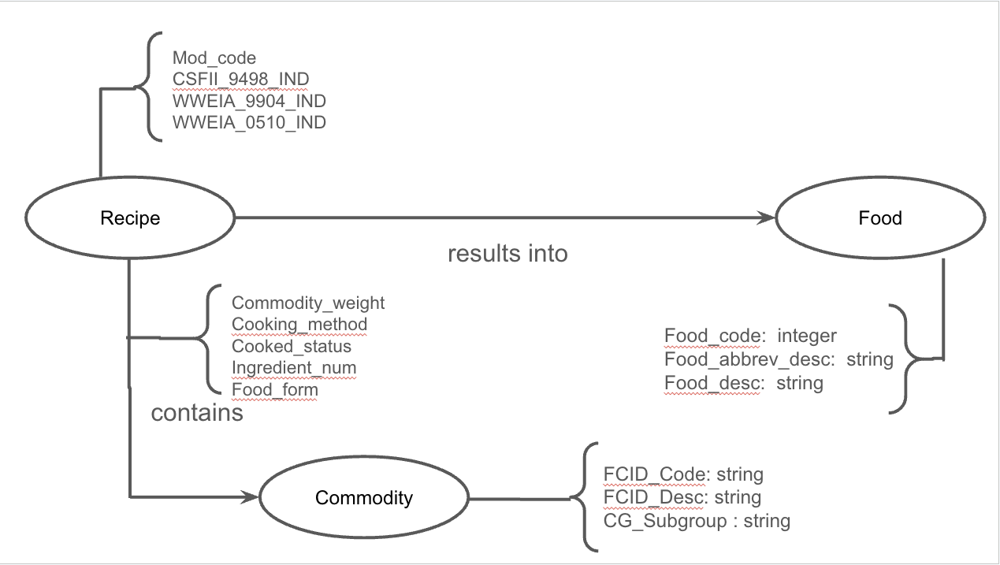

# Perguntas

1. Quais as commodities mais utilizadas?
2. Quais é o status de cozimento (cooked_status) mais comum para cada commoditie?
3. Quais comidas utilizam a maior quantidade de ingredientes para serem feitas?\

Link apresentação
https://docs.google.com/presentation/d/1tnLtMEpU8AWbrQpLex_DN5fdzCSb0UbOZ0vsUMv0yzw/edit?usp=sharing