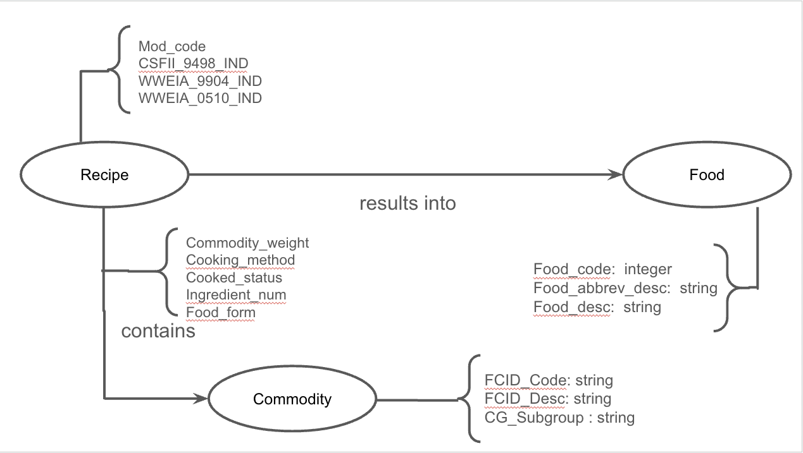

## Modelo Lógico do Banco de Dados de Grafos
> Coloque aqui o modelo lógico.
> 

## Perguntas de Pesquisa/Análise Combinadas e Respectivas Análises

> Liste aqui as perguntas de pesquisa/análise e respectivas análises.
>
### Pergunta/Análise 1
> * Quais as commodities mais utilizadas?
>   
>   * Utilzando a centralidade, podemos visualizar quais Nos são mais utilizadas em Receitas, usando a propriedade Belongs to na relaçao Commodity -> Recipe

### Pergunta/Análise 2
> * Qual é o status de cozimento (cooked_status) mais comum para cada commoditie?
>   
>   * Utilizando a comunidade/modularidade, podemos criar uma relação entre o status de cozimento com a commoditie pertencente a cada receita. Desta forma podemos visualizar quais casos mais comuns para cada tipo analisado. 

### Pergunta/Análise 3
> *  Quais comidas utilizam a maior quantidade de ingredientes para serem feitas?
>   
>   * Utilizando a comunidade/modularidade, podemos unir receitas que possuem um grande numero de commodidites, e analisar quais grupos de comidas são preparadas com o maior uso de ingredientes.
